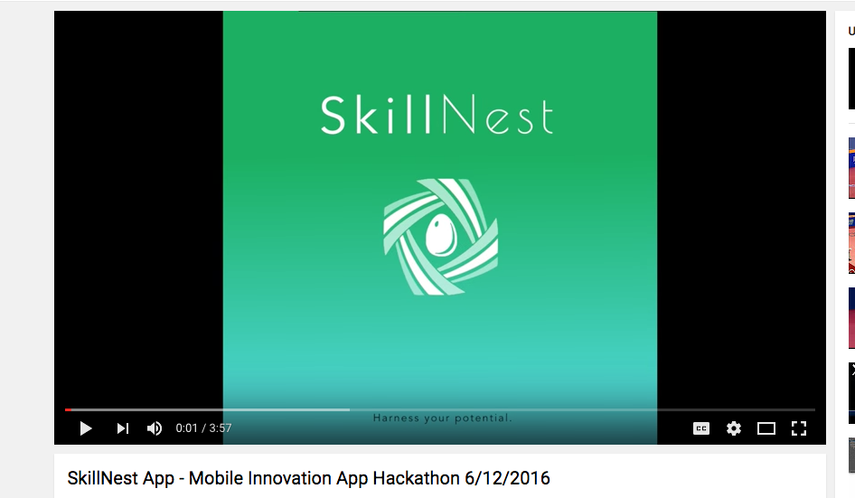
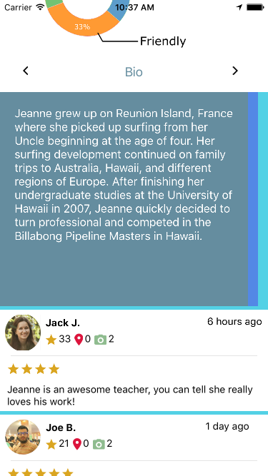
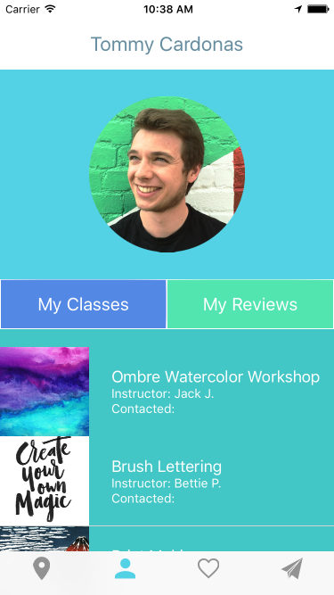
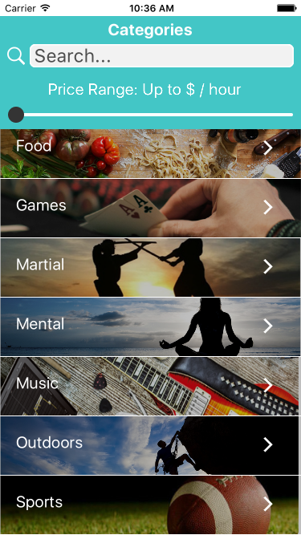
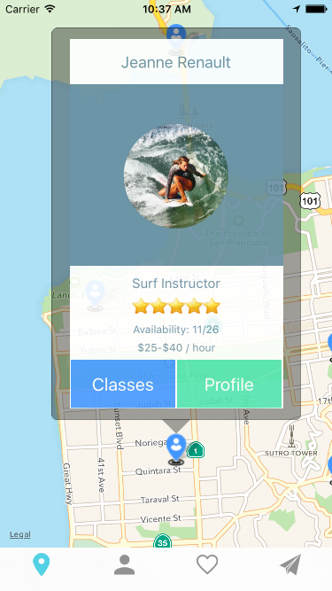
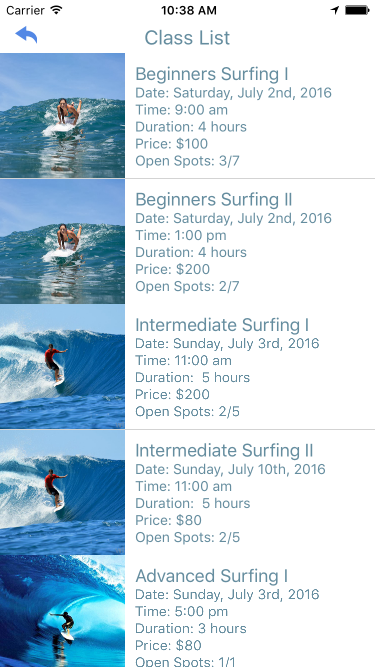
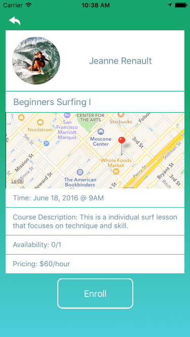

# SkillNest 

Skillnest is a mobile platform that uses a real-time database to allow students to browse local courses and connect with skilled teachers. Skillnest also sets up a space where teachers can display concise information about their background, their philosophy, and their course offerings in order to market themselves more effectively. Technologies used include React Native, ECMS 6, and Firebase.

## Watch the demo
<a href="https://www.youtube.com/watch?v=ysyDFT27_ug&feature=youtu.be"></a>

##Inspiration


Have you ever wanted to learn an instrument, a language, or maybe a new sport?
Have you been interested in wine-making, surfing, or cooking classes?
Have you had difficulty figuring out where to start, what path to take or just wanted to find an amazing teacher in your area?  

Maybe you haven't had the time to sift through craigslist, or maybe you have and you found someone who wasn’t a great match.

Here’s the bottom line: People want to learn things and many do not know where to start.  They want a personal, transformative experience, but do not know how to go about finding it.

The solution is SkillNest and we are creating the Yelp of personal teaching.  This is a multi-billion dollar industry that has largely gone unnoticed because of its cash payment roots.

##Screen Shots
#### Teacher/Student profile
 

#### Categories/MapView 
 

#### Classe list/Class detail
 


##Technology

The full tech stack for our application includes React Native, Javascript ECMS 6 and Firebase.

##License
MIT

##Test it on your machine locally
- Clone this repo ```git clone https://github.com/OUCHUNYU/Ralli.git```
- ```cd skillnest```
- run `npm install` in your command line tool
- Open skillnest.xcodeproj in XCode
- Press cmd+r to build it


